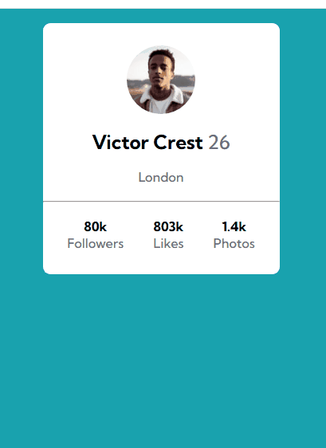

# Exercício flexbox e variáveis card-profile.
Uso de variáveis no css, alinhamento usando propriedade flexbox.
## Tecnologias utilizadas
- HTML5
- CSS3
## Objetivos
- Praticar os conteúdos do curso
- Responsividade.
- Alinhamento dos elementos.
## Prévia da aplicação
[]
